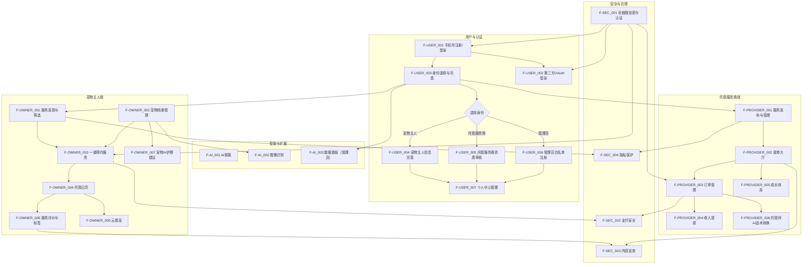
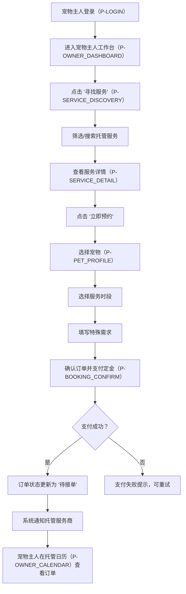
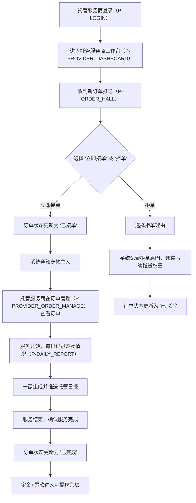
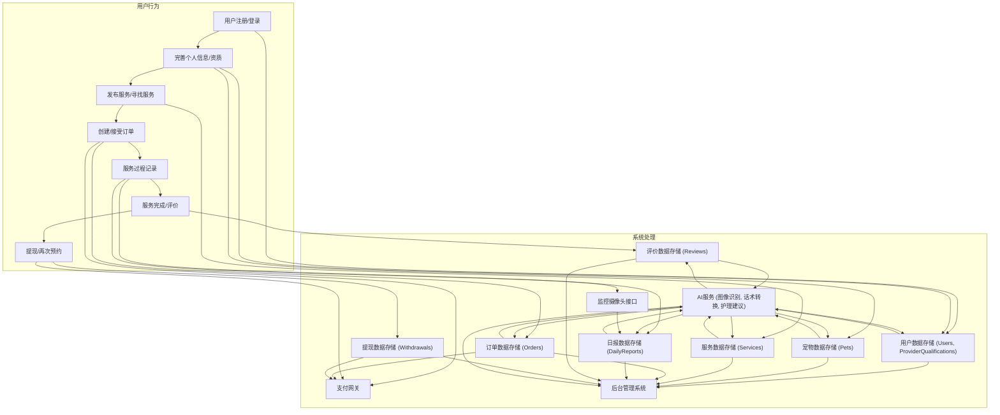

# 宠托帮产品需求文档

## 1. 产品概述

### 1.1 产品名称与定位

*   **产品名称:** 宠托帮
*   **产品定位:** 一款专注于“社区级宠物托管”的撮合平台，旨在高效、安全地连接有托管需求的宠物主人和有能力、有场地、有爱心的托管服务商（个人或门店）。

### 1.2 产品应用语言

*   **产品应用语言:** 简体中文

### 1.3 产品愿景与目标

*   **产品愿景:** 成为社区宠物托管服务的首选平台，构建一个便捷、安全、值得信赖的宠物托管生态系统。
*   **产品目标:**
    *   提升宠物主人与托管服务商的匹配效率，解决信息不对称问题。
    *   建立完善的安全保障机制，确保宠物托管过程的透明与可追溯，增强用户信任。
    *   提供标准化的服务流程和评价体系，提升整体服务质量。
    *   通过AI技术赋能，降低运营成本，提升用户体验。

### 1.4 系统架构
*   **架构模式:** 前后端分离+微服务架构
*   **前端层:** Vue框架开发，支持Web端
*   **后端层:** Flask框架开发
*   **数据层:** MySQL关系型数据库，存储用户信息、订单、宠物档案等结构化数据

### 1.5 产品使用终端
*   **主要终端:** Web端桌面应用
*   **浏览器支持:** Chrome 90+、Firefox 88+、Safari 14+、Edge 90+
*   **分辨率支持:** 768x480及以上分辨率，最佳体验为1920x1080
*   **响应式适配:** 支持768px以上的所有桌面和平板设备。

### 1.5 核心价值主张

*   **高效匹配:** 基于多维度筛选和智能推荐，快速找到符合需求的托管服务。
*   **安全保障:** 强制实名认证、AI+人工审核、24小时监控接入、资金托管，全方位保障宠物和用户安全。
*   **透明可追溯:** 托管日报、实时视频/照片、服务过程记录，让宠物主人随时了解宠物状况。
*   **信任体系:** 双向评价、成长体系、AI标签沉淀，构建用户间的长期信任。

### 1.6 目标用户群体分析

*   **宠物主人:**
    *   **特征:** 养宠物的城市年轻白领，注重宠物健康和生活质量，对托管服务的安全性和便捷性有较高要求。
    *   **需求:** 寻找可靠、专业、离家近的托管服务；希望托管过程透明可控；需要便捷的预约和支付流程。
*   **托管服务商:**
    *   **特征:** 宠物托管门店经营者、兼职宠物托管个人、宠物行业创业者、宠物医院工作人员。拥有场地、时间和爱心，希望将资源转化为收入。
    *   **需求:** 获得更多托管订单；管理订单和宠物信息；便捷的提现功能；建立个人或门店口碑。
*   **管理员:**
    *   **特征:** 平台运营和管理人员，负责用户审核、内容巡查、数据分析和平台维护。
    *   **需求:** 高效的后台管理工具；实时数据监控；风险预警和干预能力。

### 1.7 市场需求与竞品简析

*   **市场需求:** 随着养宠家庭数量的增加，宠物托管需求日益旺盛。传统托管方式存在信息不透明、信任度低、匹配效率差等问题。用户对便捷、安全、个性化的托管服务有强烈需求。
*   **竞品简析:**
    *   **传统宠物店/宠物医院:** 服务专业但灵活性不足，价格较高，覆盖范围有限。
    *   **C2C宠物托管平台:** 如“宠物帮”、“宠物之家”等，提供匹配服务，但在安全保障、服务标准化和信任体系方面仍有提升空间。
    *   **宠托帮优势:** 结合了强制实名认证、AI审核、24小时监控、智能匹配和完善的评价体系，旨在解决现有市场的痛点，提供更安全、高效、可信赖的托管服务。

### 1.8 浏览器兼容性要求

*   **桌面浏览器:**
    *   Google Chrome (最新2个稳定版本)
    *   Mozilla Firefox (最新2个稳定版本)
    *   Microsoft Edge (最新2个稳定版本)
    *   Apple Safari (最新2个稳定版本)
*   **分辨率:** 针对1024x768及以上分辨率进行优化，最佳体验分辨率为1920x1080。
*   **响应式设计:** 确保在不同屏幕尺寸下（特别是768px以上）提供良好的用户体验，布局和内容自适应调整。

## 2. 功能规格

### 2.1 功能详述

#### 2.1.1 用户与认证管理

| 功能ID | 功能名称 | 功能描述 | 优先级 |
|--------|---------|---------|--------|
| F-USER_001 | 手机号注册/登录 | 用户通过手机号+验证码进行注册和登录，支持密码设置和找回。 | P0 |
| F-USER_002 | 第三方OAuth登录 | 预留微信、QQ、Apple ID等第三方OAuth接口，方便用户快速登录。 | P1 |
| F-USER_003 | 身份选择与完善 | 首次登录强制选择身份（宠物主人/托管服务商/管理员），并根据身份完善相应信息。 | P0 |
| F-USER_004 | 宠物主人信息完善 | 宠物主人需填写昵称、地址、上传头像，可跳过宠物档案稍后完善。 | P0 |
| F-USER_005 | 托管服务商资质审核 | 托管服务商必须提交身份证正反面、手持自拍、环境照片及营业执照（如有），平台进行1-3个工作日人工+系统双重审核。 | P0 |
| F-USER_006 | 管理员白名单注册 | 管理员需后台预录入超级白名单，普通用户不可随意注册。 | P0 |
| F-USER_007 | 个人中心管理 | 用户可查看和修改个人信息、修改密码、绑定第三方账号等。 | P1 |

#### 2.1.2 宠物主人端功能

| 功能ID | 功能名称 | 功能描述 | 优先级 |
|--------|---------|---------|--------|
| F-OWNER_001 | 服务发现与筛选 | 可按“距离≤3 km、价格区间、宠物类型、评分≥4.5、可接送”等多维筛选，支持地图热力模式和列表模式切换。 | P0 |
| F-OWNER_002 | 宠物档案管理 | 支持添加多只宠物，填写昵称、品种、生日、性别、疫苗与驱虫记录、过敏史、性格标签；上传正面照后由AI自动识别品种并补全体型、毛长等字段。 | P0 |
| F-OWNER_003 | 一键预约服务 | 选择服务→选择宠物→选择时段→填写特殊需求→支付定金。支付成功后订单状态实时推送给双方。 | P0 |
| F-OWNER_004 | 托管日历 | 用时间轴展示“待接单/已接单/服务中/已完成/已取消”全部订单，支持取消、改期、申请退款、追加小费。 | P0 |
| F-OWNER_005 | 云看宠 | 平台提供24h监控摄像头接入接口（可选），托管师上传实时短视频或照片，主人可在“云看宠”页面查看。 | P1 |
| F-OWNER_006 | 服务评价与标签 | 服务结束24h内主人可打1～5星、写文字、上传照片；AI自动提取关键词生成“耐心”“环境好”“按时喂药”等标签，沉淀到服务商档案页。 | P0 |
| F-OWNER_007 | 宠物AI护理建议 | 根据宠物品种、年龄、体重推送“7岁金毛避免剧烈跑跳”“布偶猫每日梳毛防毛球”等科普。 | P1 |

#### 2.1.3 托管服务商端功能

| 功能ID | 功能名称 | 功能描述 | 优先级 |
|--------|---------|---------|--------|
| F-PROVIDER_001 | 服务发布与管理 | 发布托管信息：服务类型（日托/周托/临时照看）、价格、可托管宠物类型（猫/狗/小型宠物）、服务内容（喂食/遛弯/医疗陪护）、时间范围、地址及环境照片；AI根据服务类型和宠物类型自动生成“托管注意事项”，可二次编辑。 | P0 |
| F-PROVIDER_002 | 接单大厅 | 实时推送符合自己条件的订单，可“立即接单”或“拒单”；拒单需选择理由，平台会据此调整后续推送权重。 | P0 |
| F-PROVIDER_003 | 订单管理 | 支持批量确认、设置档期自动上下架、冲突检测；支持给每只托管宠物建立“每日记录”（喂食、排便、运动、照片），一键生成“托管日报”推送给主人。 | P0 |
| F-PROVIDER_004 | 收入提现 | 订单完成后定金＋尾款自动进入“可提现余额”，T+1到账银行卡；平台抽成比例在后台可见，账单支持导出Excel。 | P0 |
| F-PROVIDER_005 | 成长体系 | 好评率、接单量、响应速度等指标加权计算“综合评分”，评分越高搜索排名越靠前；连续30天无违规即可获得“金牌托管师”徽章，平台额外流量倾斜。 | P1 |
| F-PROVIDER_006 | 托管师AI话术转换 | 接收主人预约时输入的特殊需求，系统自动生成礼貌专业的“服务提示”。 | P1 |
| F-PROVIDER_007 | 实时沟通 | 通过内置聊天功能与宠物主人进行文本+图片沟通，支持查看历史聊天记录。 | P1 |

#### 2.1.4 智能与扩展功能

| 功能ID | 功能名称 | 功能描述 | 优先级 |
|--------|---------|---------|--------|
| F-AI_001 | AI客服 | 7×24小时问答：解决用户常见问题（如“托管需要带什么证件？”“宠物生病怎么办？”）；问题分类：自动识别问题类型（预约相关/支付相关/宠物健康），高效回复；无法回答的问题自动转接人工客服（管理员处理）。 | P0 |
| F-AI_002 | 图像识别 | 上传宠物照片即可识别品种、估算年龄，减少手动输入；基于宠物年龄和品种，推送个性化护理建议（如“7岁金毛建议减少剧烈运动”）。 | P1 |
| F-AI_003 | 托管注意事项生成 | 发布服务时，根据服务类型和宠物类型自动生成“托管注意事项”（如“幼犬托管需注意喂食频率”）。 | P1 |
| F-AI_004 | 评价标签生成 | 基于用户文字评价，自动提取关键词生成评价标签（如“耐心”“环境好”）。 | P1 |
| F-AI_005 | 数据看板（管理员） | 实时显示注册用户数、活跃服务商数、订单转化率、客单价、退款率、热门区域等，支持AI预测未来7日订单峰值。 | P0 |

#### 2.1.5 互动与评价模块

| 功能ID | 功能名称 | 功能描述 | 优先级 |
|--------|---------|---------|--------|
| F-COMM_001 | 实时沟通 | 用户与服务商内置聊天功能：支持文本+图片消息，简化版可用消息通知替代实时聊天。 | P1 |
| F-COMM_002 | 服务评价 | 用户完成订单后评分（1-5星）+文字评价，支持上传服务过程照片；AI自动提取关键词生成评价标签（如“耐心”“环境好”）。 | P0 |

#### 2.1.6 安全与合规

| 功能ID | 功能名称 | 功能描述 | 优先级 |
|--------|---------|---------|--------|
| F-SEC_001 | 全链路加密与认证 | SSL全链路加密、JWT令牌+刷新机制、短信验证码防刷。 | P0 |
| F-SEC_002 | 支付安全 | 支付对接官方沙箱，正式环境需商户号+实名认证+资金托管，平台不触碰二清。 | P0 |
| F-SEC_003 | 内容巡查 | AI敏感词过滤+人工复审，违规评价、虚假服务30分钟内下架。 | P1 |
| F-SEC_004 | 隐私保护 | 宠物定位、家庭地址等敏感字段脱敏展示，只有达成订单后才对双方可见。 | P0 |

### 2.2 功能模块间的关系图

## 3. 用户流程

### 3.1 用户旅程地图

#### 3.1.1 宠物主人用户旅程

| 阶段 | 行为 | 思考/感受 | 触点 | 痛点 | 解决方案 |
|------|------|-----------|------|------|----------|
| **发现需求** | 计划外出，需要托管宠物 | 焦虑，担心宠物无人照顾 | 朋友推荐、社交媒体、搜索引擎 | 找不到合适的托管 | 宠托帮平台 |
| **注册/登录** | 访问平台，注册并选择身份 | 期待，希望快速找到服务 | 宠托帮网站（P-LOGIN） | 注册流程繁琐 | 手机号+验证码快速注册，身份选择引导 |
| **完善信息** | 填写个人信息，创建宠物档案 | 谨慎，希望信息准确 | 宠物主人工作台（P-OWNER_DASHBOARD）、宠物档案管理（P-PET_PROFILE） | 填写麻烦，信息不全 | AI辅助填写，分步引导，可跳过 |
| **寻找服务** | 浏览托管服务，使用筛选功能 | 比较，希望找到最匹配的 | 服务发现（P-SERVICE_DISCOVERY） | 选择困难，信息不透明 | 多维度筛选，地图/列表切换，服务商评分 |
| **预约服务** | 选择服务，填写需求，支付定金 | 信任，希望流程顺畅 | 服务详情（P-SERVICE_DETAIL）、预约确认（P-BOOKING_CONFIRM） | 支付安全，信息沟通不畅 | 定金托管，特殊需求AI话术转换，实时通知 |
| **托管中** | 查看宠物状态，接收日报 | 牵挂，希望宠物安好 | 托管日历（P-OWNER_CALENDAR）、云看宠（P-CLOUD_VIEW） | 无法实时了解，信息滞后 | 24h监控接入，每日托管日报，实时照片/视频 |
| **服务结束** | 接回宠物，进行评价 | 满意/不满意，希望表达 | 托管日历（P-OWNER_CALENDAR）、服务评价（P-SERVICE_RATING） | 评价入口不明显，评价内容无引导 | 强制评价提醒，AI辅助生成标签 |
| **再次使用** | 再次需要托管时，快速预约 | 习惯，信任平台 | 宠物主人工作台（P-OWNER_DASHBOARD） | 重复操作，找不到常用服务商 | 历史订单，收藏服务商，快速预约入口 |

#### 3.1.2 托管服务商用户旅程

| 阶段 | 行为 | 思考/感受 | 触点 | 痛点 | 解决方案 |
|------|------|-----------|------|------|----------|
| **注册/登录** | 访问平台，注册并选择身份 | 期待，希望获得订单 | 宠托帮网站（P-LOGIN） | 注册流程繁琐，资质审核慢 | 手机号+验证码快速注册，AI+人工快速审核 |
| **资质审核** | 提交身份证、环境照片等资料 | 紧张，希望顺利通过 | 托管服务商工作台（P-PROVIDER_DASHBOARD）、资质审核（P-QUALIFICATION_AUDIT） | 审核标准不明确，等待时间长 | 明确审核标准，1-3个工作日反馈 |
| **发布服务** | 创建托管服务，填写详情 | 兴奋，希望服务吸引人 | 服务发布（P-SERVICE_PUBLISH） | 不知如何填写，信息不全 | AI辅助生成注意事项，模板化填写 |
| **接收订单** | 查看订单推送，决定接单/拒单 | 忙碌，希望接到合适订单 | 接单大厅（P-ORDER_HALL） | 订单推送不精准，拒单影响权重 | 智能订单匹配，拒单理由反馈 |
| **服务中** | 照顾宠物，记录每日情况 | 责任，希望宠物主人满意 | 订单管理（P-PROVIDER_ORDER_MANAGE）、托管日报（P-DAILY_REPORT） | 记录繁琐，沟通成本高 | 每日记录模板，一键生成日报，AI话术转换 |
| **服务完成** | 确认服务结束，等待提现 | 轻松，期待收入到账 | 订单管理（P-PROVIDER_ORDER_MANAGE）、收入提现（P-WITHDRAWAL） | 提现不及时，账单不清晰 | T+1到账，账单明细可导出 |
| **查看成长** | 查看评分、接单量，获得徽章 | 自豪，希望获得更多认可 | 托管服务商工作台（P-PROVIDER_DASHBOARD）、成长体系（P-GROWTH_SYSTEM） | 成长路径不清晰，激励不足 | 综合评分体系，金牌托管师徽章，流量倾斜 |
| **再次接单** | 持续提供服务，提升口碑 | 稳定，希望业务增长 | 接单大厅（P-ORDER_HALL） | 订单量不稳定，客户流失 | 好评率提升，平台流量支持 |

### 3.2 关键业务流程图

#### 3.2.1 宠物主人预约服务流程

#### 3.2.2 托管服务商接单与服务流程

### 3.3 各场景下的用户操作步骤

#### 3.3.1 宠物主人注册与完善信息

1.  **访问平台:** 用户在浏览器中输入宠托帮网址，进入登录/注册页（P-LOGIN）。
2.  **手机号注册:** 点击“注册”按钮，输入手机号，获取并输入验证码，设置登录密码，点击“注册”。
3.  **首次登录与身份选择:** 注册成功后自动登录，系统弹出身份选择弹窗，用户选择“宠物主人”。
4.  **完善宠物主人信息:** 进入宠物主人信息完善页面，填写昵称、地址，上传头像，点击“下一步”。
5.  **宠物档案创建（可选）:** 系统提示创建宠物档案，用户可选择“立即创建”或“稍后创建”。
    *   **立即创建:** 进入宠物档案管理页（P-PET_PROFILE），填写宠物昵称、品种、生日、性别、疫苗与驱虫记录、过敏史、性格标签，上传正面照。AI自动识别品种并补全体型、毛长等字段。点击“保存”。
    *   **稍后创建:** 直接进入宠物主人工作台（P-OWNER_DASHBOARD）。

#### 3.3.2 托管服务商注册与资质审核

1.  **访问平台:** 用户在浏览器中输入宠托帮网址，进入登录/注册页（P-LOGIN）。
2.  **手机号注册:** 点击“注册”按钮，输入手机号，获取并输入验证码，设置登录密码，点击“注册”。
3.  **首次登录与身份选择:** 注册成功后自动登录，系统弹出身份选择弹窗，用户选择“托管服务商”。
4.  **提交资质审核:** 进入托管服务商资质审核页（P-QUALIFICATION_AUDIT），按要求上传身份证正反面照片、手持身份证自拍照片、托管环境照片、营业执照（如有），点击“提交审核”。
5.  **等待审核结果:** 系统提示审核将在1-3个工作日内完成，用户可在托管服务商工作台（P-PROVIDER_DASHBOARD）查看审核状态。
6.  **审核通过/驳回:**
    *   **审核通过:** 系统通知用户审核通过，用户可进入服务发布页（P-SERVICE_PUBLISH）发布服务。
    *   **审核驳回:** 系统通知用户审核驳回原因，用户可根据提示修改并重新提交。

## 4. 数据流设计

### 4.1 数据结构与关系

*   **用户表 (Users):**
    *   `user_id` (PK)
    *   `phone_number` (Unique)
    *   `password_hash`
    *   `nickname`
    *   `avatar_url`
    *   `address`
    *   `identity_type` (宠物主人/托管服务商/管理员)
    *   `status` (正常/禁用/待审核)
    *   `created_at`, `updated_at`
*   **宠物档案表 (Pets):**
    *   `pet_id` (PK)
    *   `owner_id` (FK to Users.user_id)
    *   `pet_name`
    *   `breed`
    *   `estimated_age`
    *   `gender`
    *   `vaccination_records` (JSON/Text)
    *   `deworming_records` (JSON/Text)
    *   `allergies`
    *   `personality_tags` (JSON/Array)
    *   `photo_url`
    *   `ai_recognized_breed`
    *   `ai_recognized_size`
    *   `ai_recognized_fur_length`
    *   `created_at`, `updated_at`
*   **托管服务商资质表 (ProviderQualifications):**
    *   `qualification_id` (PK)
    *   `provider_id` (FK to Users.user_id)
    *   `id_card_front_url`
    *   `id_card_back_url`
    *   `id_card_selfie_url`
    *   `environment_photos_urls` (JSON/Array)
    *   `business_license_url` (Optional)
    *   `audit_status` (待审核/通过/驳回)
    *   `audit_comment`
    *   `audited_by` (FK to Users.user_id for admin)
    *   `created_at`, `updated_at`
*   **服务表 (Services):**
    *   `service_id` (PK)
    *   `provider_id` (FK to Users.user_id)
    *   `service_type` (日托/周托/小时陪遛)
    *   `pet_types_allowed` (JSON/Array)
    *   `max_pets`
    *   `price_per_unit`
    *   `address`
    *   `environment_photos_urls` (JSON/Array)
    *   `ai_generated_notes` (Text)
    *   `status` (上架/下架)
    *   `created_at`, `updated_at`
*   **订单表 (Orders):**
    *   `order_id` (PK)
    *   `owner_id` (FK to Users.user_id)
    *   `provider_id` (FK to Users.user_id)
    *   `service_id` (FK to Services.service_id)
    *   `pet_id` (FK to Pets.pet_id)
    *   `start_time`
    *   `end_time`
    *   `special_requests` (Text)
    *   `deposit_amount`
    *   `total_amount`
    *   `order_status` (待接单/已接单/服务中/已完成/已取消/退款中/已退款)
    *   `payment_status` (待支付/已支付/退款中/已退款)
    *   `created_at`, `updated_at`
*   **托管日报表 (DailyReports):**
    *   `report_id` (PK)
    *   `order_id` (FK to Orders.order_id)
    *   `report_date`
    *   `feeding_log` (Text)
    *   `toilet_log` (Text)
    *   `exercise_log` (Text)
    *   `photos_urls` (JSON/Array)
    *   `created_at`, `updated_at`
*   **评价表 (Reviews):**
    *   `review_id` (PK)
    *   `order_id` (FK to Orders.order_id)
    *   `reviewer_id` (FK to Users.user_id)
    *   `reviewee_id` (FK to Users.user_id)
    *   `rating` (1-5星)
    *   `comment` (Text)
    *   `photos_urls` (JSON/Array)
    *   `ai_generated_tags` (JSON/Array)
    *   `created_at`, `updated_at`
*   **提现记录表 (Withdrawals):**
    *   `withdrawal_id` (PK)
    *   `provider_id` (FK to Users.user_id)
    *   `amount`
    *   `status` (申请中/已完成/已拒绝)
    *   `bank_account_info` (加密存储)
    *   `created_at`, `updated_at`

### 4.2 关键数据流向图

### 4.3 数据存储与处理原则

1.  **数据安全:**
    *   所有敏感数据（如用户密码、身份证信息、银行卡信息）进行加密存储。
    *   采用SSL/TLS全链路加密传输数据。
    *   定期进行安全审计和漏洞扫描。
    *   严格的访问控制，只有授权人员才能访问敏感数据。
2.  **数据隐私:**
    *   遵循相关法律法规（如《个人信息保护法》），明确告知用户数据收集、使用目的。
    *   对用户地址、宠物定位等敏感信息进行脱敏处理，仅在必要时（如订单达成后）对交易双方可见。
    *   用户数据匿名化处理，用于数据分析和AI模型训练。
3.  **数据一致性:**
    *   采用事务管理，确保订单、支付、提现等核心业务数据的一致性。
    *   分布式系统中采用最终一致性策略，确保数据最终同步。
4.  **数据可追溯性:**
    *   所有关键操作（如订单状态变更、资金流转、内容发布）均记录操作日志，便于问题排查和审计。
    *   托管过程中的监控视频/照片、托管日报等数据长期存储，作为纠纷仲裁依据。
5.  **数据高可用:**
    *   数据库采用主从复制、集群部署等方式，确保高可用性和灾备能力。
    *   定期数据备份，并测试恢复流程。
6.  **数据处理:**
    *   AI模型处理数据时，确保数据输入的准确性和完整性。
    *   敏感词过滤、内容巡查等自动化处理后，辅以人工复审，确保内容合规。
    *   大数据分析平台实时处理用户行为和业务数据，为运营决策提供支持。

## 5. 页面规格

### 5.1 页面概览

#### 5.1.1 整体布局架构

*   **布局模式:** Web端响应式布局 - 固定顶部导航栏 + 左侧菜单 + 主内容区。特殊页面（如登录页、展示页）可根据需要调整。
*   **空间分配策略:**
    *   **顶部导航栏:** 建议高度60px，固定定位，包含Logo、主要导航链接、用户操作区域。
    *   **左侧菜单:** 建议宽度200-240px（展开）/48-56px（折叠），可折叠，用于功能模块导航。
    *   **主内容区:** 核心展示区域，建议最小宽度720px，充分利用可用空间。
    *   **右侧面板:** **严格限制使用**，仅在屏幕宽度≥1440px且功能确实必要时使用，宽度280-320px。必须在布局中占据独立空间，绝对不能遮挡主内容区，且需确保主内容区宽度≥720px。
*   **导航体系:** 顶部主导航 + 左侧功能菜单 + 面包屑导航（多层级页面）。
*   **交互模式:** 页面切换（通过左侧菜单或导航）、模态弹窗（表单编辑、确认操作）、侧边抽屉（详情查看）、右键菜单（快捷操作）。

#### 5.1.2 页面列表

| 页面ID | 页面名称 | 核心功能 | 布局类型 | 右侧面板 |
|--------|---------|---------|---------|---------|
| P-LOGIN | 登录/注册页 | 用户登录、注册、找回密码 | 单栏居中 | 不使用 |
| P-IDENTITY_SELECT | 身份选择页 | 首次登录选择用户身份 | 单栏居中 | 不使用 |
| P-OWNER_DASHBOARD | 宠物主人工作台 | 宠物主人核心功能入口、数据概览 | 二栏布局 | 慎用(仅在≥1440px且必要时) |
| P-PROVIDER_DASHBOARD | 托管服务商工作台 | 托管服务商核心功能入口、数据概览 | 二栏布局 | 慎用(仅在≥1440px且必要时) |
| P-ADMIN_DASHBOARD | 管理员工作台 | 管理员核心功能入口、数据看板 | 二栏布局 | 慎用(仅在≥1440px且必要时) |
| P-PET_PROFILE | 宠物档案管理 | 宠物主人管理宠物信息 | 二栏布局 | 不使用 |
| P-SERVICE_DISCOVERY | 服务发现 | 宠物主人浏览、筛选托管服务 | 二栏布局 | 不使用 |
| P-SERVICE_DETAIL | 服务详情 | 宠物主人查看托管服务详细信息 | 二栏布局 | 不使用 |
| P-BOOKING_CONFIRM | 预约确认 | 宠物主人确认订单并支付定金 | 模态弹窗 | 不适用 |
| P-OWNER_CALENDAR | 托管日历 | 宠物主人查看和管理所有订单 | 二栏布局 | 不使用 |
| P-CLOUD_VIEW | 云看宠 | 宠物主人实时查看托管宠物状态 | 二栏布局 | 不使用 |
| P-SERVICE_RATING | 服务评价 | 宠物主人对已完成服务进行评价 | 模态弹窗 | 不适用 |
| P-QUALIFICATION_AUDIT | 资质审核 | 托管服务商提交和查看资质审核状态 | 二栏布局 | 不使用 |
| P-SERVICE_PUBLISH | 服务发布 | 托管服务商发布和管理托管服务 | 二栏布局 | 不使用 |
| P-ORDER_HALL | 接单大厅 | 托管服务商接收和处理订单推送 | 二栏布局 | 不使用 |
| P-PROVIDER_ORDER_MANAGE | 订单管理 | 托管服务商管理所有订单和托管日报 | 二栏布局 | 不使用 |
| P-DAILY_REPORT | 托管日报 | 托管服务商填写和生成每日托管报告 | 模态弹窗 | 不适用 |
| P-WITHDRAWAL | 收入提现 | 托管服务商管理收入和提现 | 二栏布局 | 不使用 |
| P-GROWTH_SYSTEM | 成长体系 | 托管服务商查看个人成长数据和徽章 | 二栏布局 | 不使用 |
| P-USER_PROFILE | 个人中心 | 用户查看和修改个人信息 | 二栏布局 | 不使用 |
| P-AI_CUSTOMER_SERVICE | AI客服 | 用户与AI客服进行交互 | 模态弹窗/侧边悬浮 | 不适用 |
| P-DATA_DASHBOARD | 数据看板 | 管理员查看平台运营数据和AI预测 | 二栏布局 | 不使用 |

### 5.2 页面详情

#### 5.2.1 登录/注册页（P-LOGIN）

**布局架构设计：**
- 页面类型：功能型页面，用户认证入口。
- 布局模式：单栏居中布局，简洁明了。
- 空间分配：核心内容区域居中显示，背景为品牌元素或简洁设计。

**页面布局架构：**
- 顶部导航栏：无（或仅显示Logo）。
- 左侧菜单：无。
- 主内容区域：居中显示登录/注册表单，建议宽度400-500px。
  - 登录/注册切换Tab：提供登录和注册两种模式切换。
  - 手机号输入框：用于输入手机号。
  - 验证码输入框：用于输入短信验证码。
  - 密码输入框：用于设置或输入登录密码。
  - 登录/注册按钮：核心操作按钮。
  - 找回密码链接：提供密码找回功能。
  - 第三方登录图标：微信、QQ、Apple ID等。

**响应式适配策略：**
- 大屏幕(≥1440px)：单栏居中，表单宽度固定。
- 中屏幕(1200-1439px)：单栏居中，表单宽度固定。
- 小屏幕(768-1199px)：单栏居中，表单宽度自适应，最大宽度不超过屏幕宽度的80%。
- 移动端(<768px)：单栏布局，表单宽度充满屏幕，上下边距适当调整。

**组件尺寸规范：**
- 按钮尺寸：登录/注册按钮高度40px。
- 输入框：高度40px。
- 间距规范：组件间距16px，区域间距24px。

**核心功能：**
用户登录、用户注册、密码找回、第三方登录。

#### 5.2.2 身份选择页（P-IDENTITY_SELECT）

**布局架构设计：**
- 页面类型：功能型页面，引导用户选择身份。
- 布局模式：单栏居中布局，强调选择。
- 空间分配：核心内容区域居中显示，背景简洁。

**页面布局架构：**
- 顶部导航栏：无（或仅显示Logo）。
- 左侧菜单：无。
- 主内容区域：居中显示身份选择卡片，建议宽度600-800px。
  - 页面标题：如“请选择您的身份”。
  - 身份选择卡片组：包含“宠物主人”、“托管服务商”、“管理员”三种身份卡片。
    - 每张卡片包含：身份名称、简要描述、图标。
    - 点击卡片可选中。
  - 确认按钮：在选择身份后激活，点击进入对应身份的工作台或信息完善流程。

**响应式适配策略：**
- 大屏幕(≥1440px)：单栏居中，卡片组可横向排列。
- 中屏幕(1200-1439px)：单栏居中，卡片组可横向排列。
- 小屏幕(768-1199px)：单栏居中，卡片组垂直排列。
- 移动端(<768px)：单栏布局，卡片组垂直排列，充满屏幕宽度。

**组件尺寸规范：**
- 按钮尺寸：确认按钮高度40px。
- 卡片尺寸：高度120-160px，宽度根据布局自适应。
- 间距规范：卡片间距24px，区域间距32px。

**核心功能：**
用户选择平台身份。

#### 5.2.3 宠物主人工作台（P-OWNER_DASHBOARD）

**布局架构设计：**
- 页面类型：概览型页面，宠物主人核心功能入口。
- 布局模式：二栏布局，左侧菜单+主内容区。
- 空间分配：顶部导航+左侧菜单+主内容区。

**页面布局架构：**
- 顶部导航栏：Logo、全局搜索框、消息通知、用户头像（点击进入个人中心） - 建议高度60px，固定定位。
- 左侧菜单：宠物主人功能导航菜单（如：工作台、我的宠物、寻找服务、托管日历、云看宠、个人中心），当前选中“工作台”，支持折叠 - 建议宽度200-240px(展开)/48-56px(折叠)。
- 主内容区域：核心数据概览和快捷操作区域，建议最小宽度720px。
  - 页面头部：欢迎语、面包屑导航（如：首页 > 工作台） - 建议高度48-60px。
  - 数据概览区：卡片式展示待处理订单数、已完成订单数、我的宠物数量、我的收藏等关键数据。
  - 快捷操作区：常用功能入口，如“寻找服务”、“添加宠物”、“查看托管日历”。
  - 最近订单列表：表格形式展示最近的订单，包含订单状态、服务时间、服务商等信息。
  - 宠物AI护理建议区：根据宠物档案推送相关护理知识。

**响应式适配策略：**
- 大屏幕(≥1440px)：二栏布局，主内容区可采用多列布局，充分利用空间。
- 中屏幕(1200-1439px)：二栏布局，主内容区可采用多列布局，充分利用空间。
- 小屏幕(768-1199px)：左侧菜单折叠或抽屉式，主内容区卡片和列表垂直排列。
- 移动端(<768px)：单栏布局，左侧菜单抽屉式，所有内容单列显示。

**组件尺寸规范：**
- 按钮尺寸：快捷操作按钮高度36px。
- 卡片尺寸：高度120-160px，宽度根据列数自适应。
- 表格行高：36px。
- 间距规范：卡片间距16px，区域间距24px。

**核心功能：**
宠物主人核心功能入口、数据概览、快捷操作、最近订单查看、宠物AI护理建议。

#### 5.2.4 托管服务商工作台（P-PROVIDER_DASHBOARD）

**布局架构设计：**
- 页面类型：概览型页面，托管服务商核心功能入口。
- 布局模式：二栏布局，左侧菜单+主内容区。
- 空间分配：顶部导航+左侧菜单+主内容区。

**页面布局架构：**
- 顶部导航栏：Logo、全局搜索框、消息通知、用户头像（点击进入个人中心） - 建议高度60px，固定定位。
- 左侧菜单：托管服务商功能导航菜单（如：工作台、资质审核、服务发布、接单大厅、订单管理、收入提现、成长体系、个人中心），当前选中“工作台”，支持折叠 - 建议宽度200-240px(展开)/48-56px(折叠)。
- 主内容区域：核心数据概览和快捷操作区域，建议最小宽度720px。
  - 页面头部：欢迎语、面包屑导航（如：首页 > 工作台） - 建议高度48-60px。
  - 数据概览区：卡片式展示待处理订单数、进行中订单数、可提现余额、综合评分等关键数据。
  - 快捷操作区：常用功能入口，如“发布服务”、“查看接单大厅”、“管理订单”。
  - 最近订单列表：表格形式展示最近的订单，包含订单状态、服务时间、宠物主人等信息。
  - 成长体系概览：简要展示当前等级、徽章和提升建议。

**响应式适配策略：**
- 大屏幕(≥1440px)：二栏布局，主内容区可采用多列布局，充分利用空间。
- 中屏幕(1200-1439px)：二栏布局，主内容区可采用多列布局，充分利用空间。
- 小屏幕(768-1199px)：左侧菜单折叠或抽屉式，主内容区卡片和列表垂直排列。
- 移动端(<768px)：单栏布局，左侧菜单抽屉式，所有内容单列显示。

**组件尺寸规范：**
- 按钮尺寸：快捷操作按钮高度36px。
- 卡片尺寸：高度120-160px，宽度根据列数自适应。
- 表格行高：36px。
- 间距规范：卡片间距16px，区域间距24px。

**核心功能：**
托管服务商核心功能入口、数据概览、快捷操作、最近订单查看、成长体系概览。

#### 5.2.5 管理员工作台（P-ADMIN_DASHBOARD）

**布局架构设计：**
- 页面类型：概览型页面，管理员核心功能入口。
- 布局模式：二栏布局，左侧菜单+主内容区。
- 空间分配：顶部导航+左侧菜单+主内容区。

**页面布局架构：**
- 顶部导航栏：Logo、全局搜索框、消息通知、用户头像（点击进入个人中心） - 建议高度60px，固定定位。
- 左侧菜单：管理员功能导航菜单（如：工作台、用户管理、服务管理、订单管理、内容巡查、数据看板、系统设置），当前选中“工作台”，支持折叠 - 建议宽度200-240px(展开)/48-56px(折叠)。
- 主内容区域：核心数据概览和快捷操作区域，建议最小宽度720px。
  - 页面头部：欢迎语、面包屑导航（如：首页 > 工作台） - 建议高度48-60px。
  - 数据概览区：卡片式展示总注册用户数、活跃服务商数、今日订单数、待处理审核数等关键数据。
  - 快捷操作区：常用功能入口，如“用户管理”、“服务管理”、“内容巡查”。
  - 待处理任务列表：表格形式展示待审核资质、待处理投诉等任务。
  - AI预测概览：简要展示未来7日订单峰值预测。

**响应式适配策略：**
- 大屏幕(≥1440px)：二栏布局，主内容区可采用多列布局，充分利用空间。
- 中屏幕(1200-1439px)：二栏布局，主内容区可采用多列布局，充分利用空间。
- 小屏幕(768-1199px)：左侧菜单折叠或抽屉式，主内容区卡片和列表垂直排列。
- 移动端(<768px)：单栏布局，左侧菜单抽屉式，所有内容单列显示。

**组件尺寸规范：**
- 按钮尺寸：快捷操作按钮高度36px。
- 卡片尺寸：高度120-160px，宽度根据列数自适应。
- 表格行高：36px。
- 间距规范：卡片间距16px，区域间距24px。

**核心功能：**
管理员核心功能入口、数据概览、快捷操作、待处理任务查看、AI预测概览。

#### 5.2.6 宠物档案管理（P-PET_PROFILE）

**布局架构设计：**
- 页面类型：列表与表单结合型页面，管理宠物信息。
- 布局模式：二栏布局，左侧菜单+主内容区。
- 空间分配：顶部导航+左侧菜单+主内容区。

**页面布局架构：**
- 顶部导航栏：同工作台。
- 左侧菜单：同工作台，当前选中“我的宠物”。
- 主内容区域：宠物列表和添加/编辑宠物表单，建议最小宽度720px。
  - 页面头部：页面标题“我的宠物”、面包屑导航、“添加宠物”按钮 - 建议高度48-60px。
  - 宠物列表：表格形式展示已添加宠物，包含宠物名称、品种、生日、性别、操作（编辑、删除）。
  - 添加/编辑宠物表单：模态弹窗或抽屉形式，包含昵称、品种、生日、性别、疫苗与驱虫记录、过敏史、性格标签、照片上传等字段。AI自动识别品种并补全体型、毛长等字段。

**响应式适配策略：**
- 大屏幕(≥1440px)：二栏布局，宠物列表可展示更多列。
- 中屏幕(1200-1439px)：二栏布局，宠物列表可展示更多列。
- 小屏幕(768-1199px)：左侧菜单折叠或抽屉式，宠物列表可隐藏部分列，或采用卡片式展示。
- 移动端(<768px)：单栏布局，宠物列表采用卡片式展示，添加/编辑表单全屏显示。

**组件尺寸规范：**
- 按钮尺寸：添加宠物按钮高度36px。
- 表格行高：36px。
- 输入框：高度32-40px。
- 间距规范：组件间距12px，区域间距20px。

**核心功能：**
查看宠物列表、添加新宠物、编辑宠物信息、删除宠物、AI辅助填写宠物信息。

#### 5.2.7 服务发现（P-SERVICE_DISCOVERY）

**布局架构设计：**
- 页面类型：列表与筛选结合型页面，浏览托管服务。
- 布局模式：二栏布局，左侧菜单+主内容区。
- 空间分配：顶部导航+左侧菜单+主内容区。

**页面布局架构：**
- 顶部导航栏：同工作台。
- 左侧菜单：同工作台，当前选中“寻找服务”。
- 主内容区域：服务列表和筛选条件，建议最小宽度720px。
  - 页面头部：页面标题“寻找服务”、面包屑导航 - 建议高度48-60px。
  - 筛选条件区：包含距离（≤3km）、价格区间、宠物类型、评分（≥4.5）、可接送等筛选条件，支持多选。
  - 视图切换：地图热力模式和列表模式切换按钮。
  - 服务列表：
    - **列表模式:** 卡片或表格形式展示服务，包含服务商名称、服务类型、价格、评分、地址、可托管宠物类型、操作（查看详情）。
    - **地图模式:** 地图上显示服务点，点击服务点显示简要信息卡片。
  - 分页控件：显示总条数、每页条数选择、跳转功能。

**响应式适配策略：**
- 大屏幕(≥1440px)：二栏布局，筛选条件可横向排列，服务列表可多列展示。
- 中屏幕(1200-1439px)：二栏布局，筛选条件可横向排列，服务列表可多列展示。
- 小屏幕(768-1199px)：左侧菜单折叠或抽屉式，筛选条件可收起为抽屉或弹窗，服务列表单列显示。
- 移动端(<768px)：单栏布局，筛选条件为全屏弹窗，服务列表单列显示。

**组件尺寸规范：**
- 按钮尺寸：筛选按钮、视图切换按钮高度32px。
- 输入框：筛选输入框高度32px。
- 服务卡片：高度180-240px，宽度根据列数自适应。
- 间距规范：组件间距12px，区域间距20px。

**核心功能：**
浏览托管服务、多维度筛选服务、地图/列表模式切换、查看服务详情。

#### 5.2.8 服务详情（P-SERVICE_DETAIL）

**布局架构设计：**
- 页面类型：详情展示型页面，展示托管服务详细信息。
- 布局模式：二栏布局，左侧菜单+主内容区。
- 空间分配：顶部导航+左侧菜单+主内容区。

**页面布局架构：**
- 顶部导航栏：同工作台。
- 左侧菜单：同工作台，当前选中“寻找服务”。
- 主内容区域：服务详细信息展示，建议最小宽度720px。
  - 页面头部：页面标题（服务名称）、面包屑导航、收藏按钮 - 建议高度48-60px。
  - 服务基本信息：服务商名称、评分、服务类型、价格、可托管宠物类型、地址、联系方式（脱敏）。
  - 环境照片/视频：轮播图展示托管环境照片或短视频。
  - 服务介绍：详细描述服务内容、托管注意事项（AI生成）。
  - 服务商介绍：服务商个人简介、资质信息（已审核）、历史评价概览。
  - 可预约时段选择器：日历形式展示可预约时段，用户选择开始和结束时间。
  - “立即预约”按钮：在选择时段后激活。

**响应式适配策略：**
- 大屏幕(≥1440px)：二栏布局，内容区域可采用两列布局，左侧服务信息，右侧预约区域。
- 中屏幕(1200-1439px)：二栏布局，内容区域可采用两列布局，左侧服务信息，右侧预约区域。
- 小屏幕(768-1199px)：左侧菜单折叠或抽屉式，内容区域单列显示，预约区域在下方。
- 移动端(<768px)：单栏布局，所有内容单列显示。

**组件尺寸规范：**
- 按钮尺寸：立即预约按钮高度40px。
- 间距规范：组件间距16px，区域间距24px。

**核心功能：**
查看托管服务详细信息、查看服务商信息、选择预约时段、立即预约。

#### 5.2.9 预约确认（P-BOOKING_CONFIRM）

**布局架构设计：**
- 页面类型：表单与确认型页面，确认订单并支付。
- 布局模式：模态弹窗，覆盖当前页面。
- 空间分配：弹窗居中显示，内容紧凑。

**页面布局架构：**
- 顶部导航栏：不显示。
- 左侧菜单：不显示。
- 主内容区域：模态弹窗，建议宽度600-800px。
  - 弹窗标题：如“确认订单”。
  - 订单详情：服务名称、服务商、服务时段、宠物信息（可选择）、服务价格、定金金额。
  - 特殊需求输入框：用户填写宠物特殊需求（如“怕猫、需早晚视频”）。
  - 支付方式选择：微信支付、支付宝支付。
  - “提交订单并支付”按钮。
  - “取消”按钮。

**响应式适配策略：**
- 大屏幕(≥1440px)：模态弹窗居中显示。
- 中屏幕(1200-1439px)：模态弹窗居中显示。
- 小屏幕(768-1199px)：模态弹窗居中显示，宽度自适应，最大宽度不超过屏幕宽度的90%。
- 移动端(<768px)：全屏弹窗或底部滑出，确保内容完整显示。

**组件尺寸规范：**
- 按钮尺寸：提交订单按钮高度40px。
- 输入框：特殊需求输入框高度80-120px。
- 间距规范：组件间距16px，区域间距20px。

**核心功能：**
确认订单详情、选择宠物、填写特殊需求、选择支付方式、支付定金。

#### 5.2.10 托管日历（P-OWNER_CALENDAR）

**布局架构设计：**
- 页面类型：日历与列表结合型页面，管理宠物主人订单。
- 布局模式：二栏布局，左侧菜单+主内容区。
- 空间分配：顶部导航+左侧菜单+主内容区。

**页面布局架构：**
- 顶部导航栏：同工作台。
- 左侧菜单：同工作台，当前选中“托管日历”。
- 主内容区域：日历视图和订单列表，建议最小宽度720px。
  - 页面头部：页面标题“托管日历”、面包屑导航 - 建议高度48-60px。
  - 日历视图：显示月份，高亮显示有订单的日期，点击日期可查看当日订单。
  - 订单列表：时间轴或表格形式展示“待接单/已接单/服务中/已完成/已取消”全部订单，包含订单状态、服务时间、服务商、宠物、操作（取消、改期、申请退款、追加小费、评价）。
  - 订单状态筛选：可按订单状态进行筛选。

**响应式适配策略：**
- 大屏幕(≥1440px)：二栏布局，日历视图和订单列表可并列显示。
- 中屏幕(1200-1439px)：二栏布局，日历视图和订单列表可并列显示。
- 小屏幕(768-1199px)：左侧菜单折叠或抽屉式，日历视图可收起，订单列表单列显示。
- 移动端(<768px)：单栏布局，日历视图可收起，订单列表单列显示。

**组件尺寸规范：**
- 按钮尺寸：操作按钮高度32px。
- 表格行高：36px。
- 间距规范：组件间距12px，区域间距20px。

**核心功能：**
查看所有订单、按日期筛选订单、按状态筛选订单、取消订单、改期订单、申请退款、追加小费、评价服务。

#### 5.2.11 云看宠（P-CLOUD_VIEW）

**布局架构设计：**
- 页面类型：媒体展示型页面，实时查看宠物状态。
- 布局模式：二栏布局，左侧菜单+主内容区。
- 空间分配：顶部导航+左侧菜单+主内容区。

**页面布局架构：**
- 顶部导航栏：同工作台。
- 左侧菜单：同工作台，当前选中“云看宠”。
- 主内容区域：视频/照片流展示，建议最小宽度720px。
  - 页面头部：页面标题“云看宠”、面包屑导航 - 建议高度48-60px。
  - 宠物选择器：如果有多个宠物在托管，可选择查看哪个宠物的实时状态。
  - 实时视频流：显示托管师接入的24h监控摄像头实时画面（如果服务商已接入）。
  - 照片/短视频列表：托管师上传的实时照片和短视频，按时间倒序排列。
  - 刷新按钮：手动刷新最新内容。

**响应式适配策略：**
- 大屏幕(≥1440px)：二栏布局，视频流和照片列表可并列显示。
- 中屏幕(1200-1439px)：二栏布局，视频流和照片列表可并列显示。
- 小屏幕(768-1199px)：左侧菜单折叠或抽屉式，视频流和照片列表垂直排列。
- 移动端(<768px)：单栏布局，视频流和照片列表垂直排列。

**组件尺寸规范：**
- 按钮尺寸：刷新按钮高度32px。
- 视频播放器：宽度自适应，高度按比例。
- 间距规范：组件间距16px，区域间距24px。

**核心功能：**
实时查看托管宠物视频、查看托管师上传的照片和短视频。

#### 5.2.12 服务评价（P-SERVICE_RATING）

**布局架构设计：**
- 页面类型：表单型页面，用户对服务进行评价。
- 布局模式：模态弹窗，覆盖当前页面。
- 空间分配：弹窗居中显示，内容紧凑。

**页面布局架构：**
- 顶部导航栏：不显示。
- 左侧菜单：不显示。
- 主内容区域：模态弹窗，建议宽度500-700px。
  - 弹窗标题：如“评价服务”。
  - 订单信息：简要显示订单号、服务名称、服务商。
  - 星级评分：1-5星选择器。
  - 评价内容输入框：文本输入框，支持多行输入。
  - 照片上传：支持上传多张照片。
  - “提交评价”按钮。
  - “取消”按钮。

**响应式适配策略：**
- 大屏幕(≥1440px)：模态弹窗居中显示。
- 中屏幕(1200-1439px)：模态弹窗居中显示。
- 小屏幕(768-1199px)：模态弹窗居中显示，宽度自适应，最大宽度不超过屏幕宽度的90%。
- 移动端(<768px)：全屏弹窗或底部滑出，确保内容完整显示。

**组件尺寸规范：**
- 按钮尺寸：提交评价按钮高度40px。
- 输入框：评价内容输入框高度100-150px。
- 间距规范：组件间距16px，区域间距20px。

**核心功能：**
对已完成服务进行星级评分、撰写评价内容、上传评价照片、AI自动生成评价标签。

#### 5.2.13 资质审核（P-QUALIFICATION_AUDIT）

**布局架构设计：**
- 页面类型：表单与状态展示型页面，托管服务商提交和查看资质审核。
- 布局模式：二栏布局，左侧菜单+主内容区。
- 空间分配：顶部导航+左侧菜单+主内容区。

**页面布局架构：**
- 顶部导航栏：同工作台。
- 左侧菜单：同工作台，当前选中“资质审核”。
- 主内容区域：资质提交表单和审核状态，建议最小宽度720px。
  - 页面头部：页面标题“资质审核”、面包屑导航 - 建议高度48-60px。
  - 审核状态显示：显示当前审核状态（待审核/审核通过/审核驳回），驳回时显示驳回原因。
  - 资质提交表单：
    - 身份证正反面照片上传。
    - 手持身份证自拍照片上传。
    - 托管环境照片上传（多张）。
    - 营业执照照片上传（可选）。
  - “提交审核”按钮：在未提交或审核驳回时可点击。
  - “重新提交”按钮：在审核驳回时可点击。

**响应式适配策略：**
- 大屏幕(≥1440px)：二栏布局，表单可多列显示。
- 中屏幕(1200-1439px)：二栏布局，表单可多列显示。
- 小屏幕(768-1199px)：左侧菜单折叠或抽屉式，表单单列显示。
- 移动端(<768px)：单栏布局，表单单列显示。

**组件尺寸规范：**
- 按钮尺寸：提交审核按钮高度40px。
- 上传组件：尺寸根据设计稿。
- 间距规范：组件间距16px，区域间距24px。

**核心功能：**
提交托管服务商资质材料、查看资质审核状态、接收审核结果通知。

#### 5.2.14 服务发布（P-SERVICE_PUBLISH）

**布局架构设计：**
- 页面类型：表单型页面，托管服务商发布和管理服务。
- 布局模式：二栏布局，左侧菜单+主内容区。
- 空间分配：顶部导航+左侧菜单+主内容区。

**页面布局架构：**
- 顶部导航栏：同工作台。
- 左侧菜单：同工作台，当前选中“服务发布”。
- 主内容区域：服务发布表单和已发布服务列表，建议最小宽度720px。
  - 页面头部：页面标题“服务发布”、面包屑导航、“新增服务”按钮 - 建议高度48-60px。
  - 已发布服务列表：表格形式展示已发布服务，包含服务名称、类型、价格、状态、操作（编辑、下架/上架、删除）。
  - 新增/编辑服务表单：模态弹窗或抽屉形式，包含：
    - 服务类型（日托/周托/小时陪遛）。
    - 可托管宠物种类与数量。
    - 价格。
    - 地址。
    - 环境照片上传。
    - 托管注意事项（AI自动生成，可编辑）。

**响应式适配策略：**
- 大屏幕(≥1440px)：二栏布局，服务列表可展示更多列。
- 中屏幕(1200-1439px)：二栏布局，服务列表可展示更多列。
- 小屏幕(768-1199px)：左侧菜单折叠或抽屉式，服务列表可隐藏部分列，或采用卡片式展示。
- 移动端(<768px)：单栏布局，服务列表采用卡片式展示，新增/编辑表单全屏显示。

**组件尺寸规范：**
- 按钮尺寸：新增服务按钮高度36px。
- 表格行高：36px。
- 输入框：高度32-40px。
- 间距规范：组件间距12px，区域间距20px。

**核心功能：**
发布新的托管服务、编辑已发布服务、管理服务上下架、删除服务、AI辅助生成托管注意事项。

#### 5.2.15 接单大厅（P-ORDER_HALL）

**布局架构设计：**
- 页面类型：列表型页面，托管服务商接收和处理订单推送。
- 布局模式：二栏布局，左侧菜单+主内容区。
- 空间分配：顶部导航+左侧菜单+主内容区。

**页面布局架构：**
- 顶部导航栏：同工作台。
- 左侧菜单：同工作台，当前选中“接单大厅”。
- 主内容区域：待处理订单列表，建议最小宽度720px。
  - 页面头部：页面标题“接单大厅”、面包屑导航 - 建议高度48-60px。
  - 订单列表：表格形式展示实时推送的符合条件的订单，包含订单ID、宠物主人、宠物信息、服务类型、服务时段、特殊需求（AI话术转换后）、操作（立即接单、拒单）。
  - 订单筛选：可按服务类型、宠物类型等进行筛选。

**响应式适配策略：**
- 大屏幕(≥1440px)：二栏布局，订单列表可展示更多列。
- 中屏幕(1200-1439px)：二栏布局，订单列表可展示更多列。
- 小屏幕(768-1199px)：左侧菜单折叠或抽屉式，订单列表可隐藏部分列，或采用卡片式展示。
- 移动端(<768px)：单栏布局，订单列表采用卡片式展示。

**组件尺寸规范：**
- 按钮尺寸：立即接单/拒单按钮高度32px。
- 表格行高：36px。
- 间距规范：组件间距12px，区域间距20px。

**核心功能：**
实时接收订单推送、查看订单详情、立即接单、拒单并选择理由、AI话术转换特殊需求。

#### 5.2.16 订单管理（P-PROVIDER_ORDER_MANAGE）

**布局架构设计：**
- 页面类型：列表与详情结合型页面，托管服务商管理订单和托管日报。
- 布局模式：二栏布局，左侧菜单+主内容区。
- 空间分配：顶部导航+左侧菜单+主内容区。

**页面布局架构：**
- 顶部导航栏：同工作台。
- 左侧菜单：同工作台，当前选中“订单管理”。
- 主内容区域：订单列表和订单详情/日报填写区，建议最小宽度720px。
  - 页面头部：页面标题“订单管理”、面包屑导航 - 建议高度48-60px。
  - 订单列表：表格形式展示所有订单，包含订单ID、宠物主人、宠物信息、服务类型、服务时段、订单状态、操作（查看详情、填写日报、确认完成）。
  - 订单状态筛选：可按订单状态进行筛选。
  - 批量操作：支持批量确认、设置档期自动上下架、冲突检测。
  - 订单详情/日报填写区：点击订单列表项后，在右侧抽屉或主内容区下方展开，显示订单详细信息，并提供“填写日报”按钮。

**响应式适配策略：**
- 大屏幕(≥1440px)：二栏布局，订单列表和详情/日报区可并列显示。
- 中屏幕(1200-1439px)：二栏布局，订单列表和详情/日报区可并列显示。
- 小屏幕(768-1199px)：左侧菜单折叠或抽屉式，订单列表可隐藏部分列，详情/日报区可收起或全屏显示。
- 移动端(<768px)：单栏布局，订单列表采用卡片式展示，详情/日报区全屏显示。

**组件尺寸规范：**
- 按钮尺寸：填写日报/确认完成按钮高度32px。
- 表格行高：36px。
- 间距规范：组件间距12px，区域间距20px。

**核心功能：**
查看所有订单、按状态筛选订单、查看订单详情、填写每日托管日报、一键生成托管日报、确认服务完成、批量操作。

#### 5.2.17 托管日报（P-DAILY_REPORT）

**布局架构设计：**
- 页面类型：表单型页面，托管服务商填写每日托管报告。
- 布局模式：模态弹窗，覆盖当前页面。
- 空间分配：弹窗居中显示，内容紧凑。

**页面布局架构：**
- 顶部导航栏：不显示。
- 左侧菜单：不显示。
- 主内容区域：模态弹窗，建议宽度600-800px。
  - 弹窗标题：如“填写托管日报”。
  - 订单信息：简要显示订单号、宠物名称、日期。
  - 喂食记录：文本输入框，记录喂食情况。
  - 排便记录：文本输入框，记录排便情况。
  - 运动记录：文本输入框，记录运动情况。
  - 照片上传：支持上传多张照片。
  - “提交日报”按钮。
  - “取消”按钮。

**响应式适配策略：**
- 大屏幕(≥1440px)：模态弹窗居中显示。
- 中屏幕(1200-1439px)：模态弹窗居中显示。
- 小屏幕(768-1199px)：模态弹窗居中显示，宽度自适应，最大宽度不超过屏幕宽度的90%。
- 移动端(<768px)：全屏弹窗或底部滑出，确保内容完整显示。

**组件尺寸规范：**
- 按钮尺寸：提交日报按钮高度40px。
- 输入框：文本输入框高度80-120px。
- 间距规范：组件间距16px，区域间距20px。

**核心功能：**
填写宠物每日喂食、排便、运动记录、上传每日照片、一键生成并推送托管日报。

#### 5.2.18 收入提现（P-WITHDRAWAL）

**布局架构设计：**
- 页面类型：列表与表单结合型页面，托管服务商管理收入和提现。
- 布局模式：二栏布局，左侧菜单+主内容区。
- 空间分配：顶部导航+左侧菜单+主内容区。

**页面布局架构：**
- 顶部导航栏：同工作台。
- 左侧菜单：同工作台，当前选中“收入提现”。
- 主内容区域：收入概览和提现记录，建议最小宽度720px。
  - 页面头部：页面标题“收入提现”、面包屑导航 - 建议高度48-60px。
  - 收入概览：显示可提现余额、累计收入、平台抽成比例。
  - “申请提现”按钮。
  - 提现记录列表：表格形式展示历史提现记录，包含提现金额、申请时间、到账时间、状态（申请中/已完成/已拒绝）。
  - 账单导出：支持导出Excel账单。

**响应式适配策略：**
- 大屏幕(≥1440px)：二栏布局，收入概览和提现记录可并列显示。
- 中屏幕(1200-1439px)：二栏布局，收入概览和提现记录可并列显示。
- 小屏幕(768-1199px)：左侧菜单折叠或抽屉式，收入概览和提现记录垂直排列。
- 移动端(<768px)：单栏布局，收入概览和提现记录垂直排列。

**组件尺寸规范：**
- 按钮尺寸：申请提现按钮高度40px。
- 表格行高：36px。
- 间距规范：组件间距16px，区域间距24px。

**核心功能：**
查看可提现余额、申请提现、查看提现记录、导出账单。

#### 5.2.19 成长体系（P-GROWTH_SYSTEM）

**布局架构设计：**
- 页面类型：数据展示型页面，托管服务商查看个人成长数据和徽章。
- 布局模式：二栏布局，左侧菜单+主内容区。
- 空间分配：顶部导航+左侧菜单+主内容区。

**页面布局架构：**
- 顶部导航栏：同工作台。
- 左侧菜单：同工作台，当前选中“成长体系”。
- 主内容区域：成长数据和徽章展示，建议最小宽度720px。
  - 页面头部：页面标题“成长体系”、面包屑导航 - 建议高度48-60px。
  - 综合评分：显示当前综合评分，以及评分构成（好评率、接单量、响应速度）。
  - 成长进度：显示距离下一等级或徽章的进度。
  - 已获得徽章：展示已获得的徽章（如“金牌托管师”），点击可查看详情。
  - 提升建议：根据当前数据提供个性化提升建议。

**响应式适配策略：**
- 大屏幕(≥1440px)：二栏布局，内容区域可采用多列布局。
- 中屏幕(1200-1439px)：二栏布局，内容区域可采用多列布局。
- 小屏幕(768-1199px)：左侧菜单折叠或抽屉式，内容区域单列显示。
- 移动端(<768px)：单栏布局，内容区域单列显示。

**组件尺寸规范：**
- 徽章图标：尺寸根据设计稿。
- 间距规范：组件间距16px，区域间距24px。

**核心功能：**
查看综合评分、查看成长进度、查看已获得徽章、接收提升建议。

#### 5.2.20 个人中心（P-USER_PROFILE）

**布局架构设计：**
- 页面类型：表单型页面，用户查看和修改个人信息。
- 布局模式：二栏布局，左侧菜单+主内容区。
- 空间分配：顶部导航+左侧菜单+主内容区。

**页面布局架构：**
- 顶部导航栏：同工作台。
- 左侧菜单：同工作台，当前选中“个人中心”。
- 主内容区域：个人信息展示和编辑表单，建议最小宽度720px。
  - 页面头部：页面标题“个人中心”、面包屑导航 - 建议高度48-60px。
  - 个人信息展示：头像、昵称、手机号、地址等。
  - “编辑资料”按钮。
  - 账号安全：修改密码、绑定/解绑第三方账号。
  - 通知设置：消息通知偏好设置。

**响应式适配策略：**
- 大屏幕(≥1440px)：二栏布局，内容区域可采用两列布局。
- 中屏幕(1200-1439px)：二栏布局，内容区域可采用两列布局。
- 小屏幕(768-1199px)：左侧菜单折叠或抽屉式，内容区域单列显示。
- 移动端(<768px)：单栏布局，内容区域单列显示。

**组件尺寸规范：**
- 按钮尺寸：编辑资料按钮高度36px。
- 输入框：高度32-40px。
- 间距规范：组件间距16px，区域间距24px。

**核心功能：**
查看个人信息、编辑个人资料、修改密码、绑定/解绑第三方账号、设置通知偏好。

#### 5.2.21 AI客服（P-AI_CUSTOMER_SERVICE）

**布局架构设计：**
- 页面类型：交互型页面，用户与AI客服进行对话。
- 布局模式：模态弹窗或侧边悬浮窗，不影响主页面操作。
- 空间分配：弹窗或悬浮窗固定在屏幕右下角或居中。

**页面布局架构：**
- 顶部导航栏：不显示。
- 左侧菜单：不显示。
- 主内容区域：模态弹窗或侧边悬浮窗，建议宽度400-500px，高度500-600px。
  - 弹窗标题：如“AI客服”。
  - 对话历史区：显示用户与AI的对话记录。
  - 输入框：用户输入问题。
  - “发送”按钮。
  - “转人工”按钮：当AI无法回答时显示。

**响应式适配策略：**
- 大屏幕(≥1440px)：模态弹窗或侧边悬浮窗。
- 中屏幕(1200-1439px)：模态弹窗或侧边悬浮窗。
- 小屏幕(768-1199px)：模态弹窗居中显示，宽度自适应。
- 移动端(<768px)：全屏弹窗或底部滑出。

**组件尺寸规范：**
- 按钮尺寸：发送/转人工按钮高度36px。
- 输入框：高度40px。
- 间距规范：组件间距12px，区域间距16px。

**核心功能：**
7×24小时回答高频问题、自动识别无法回答问题并转人工。

#### 5.2.22 数据看板（P-DATA_DASHBOARD）

**布局架构设计：**
- 页面类型：数据可视化型页面，管理员查看平台运营数据。
- 布局模式：二栏布局，左侧菜单+主内容区。
- 空间分配：顶部导航+左侧菜单+主内容区。

**页面布局架构：**
- 顶部导航栏：同工作台。
- 左侧菜单：同工作台，当前选中“数据看板”。
- 主内容区域：数据图表和统计信息，建议最小宽度720px。
  - 页面头部：页面标题“数据看板”、面包屑导航 - 建议高度48-60px。
  - 核心指标卡片区：显示注册用户数、活跃服务商数、订单转化率、客单价、退款率等关键指标。
  - 趋势图：如用户增长趋势、订单量趋势、收入趋势。
  - 热门区域分布图：地图或柱状图展示热门托管区域。
  - AI预测区：展示AI预测的未来7日订单峰值。
  - 数据筛选器：可按时间范围、区域等进行数据筛选。

**响应式适配策略：**
- 大屏幕(≥1440px)：二栏布局，图表可多列展示。
- 中屏幕(1200-1439px)：二栏布局，图表可多列展示。
- 小屏幕(768-1199px)：左侧菜单折叠或抽屉式，图表垂直排列。
- 移动端(<768px)：单栏布局，图表垂直排列。

**组件尺寸规范：**
- 卡片尺寸：高度120-160px。
- 图表尺寸：宽度自适应，高度根据内容。
- 间距规范：组件间距16px，区域间距24px。

**核心功能：**
实时显示平台运营数据、提供多维度数据筛选、展示AI预测的未来订单峰值。

